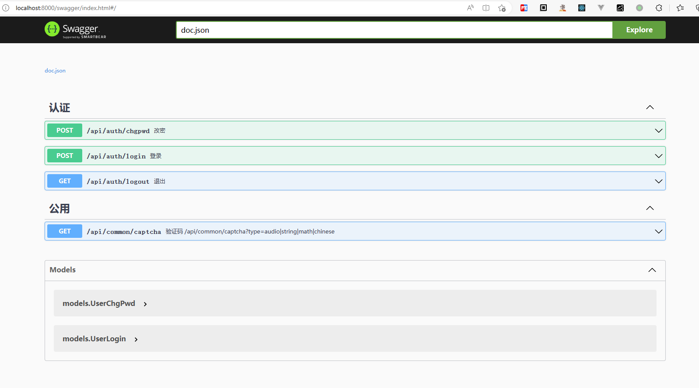
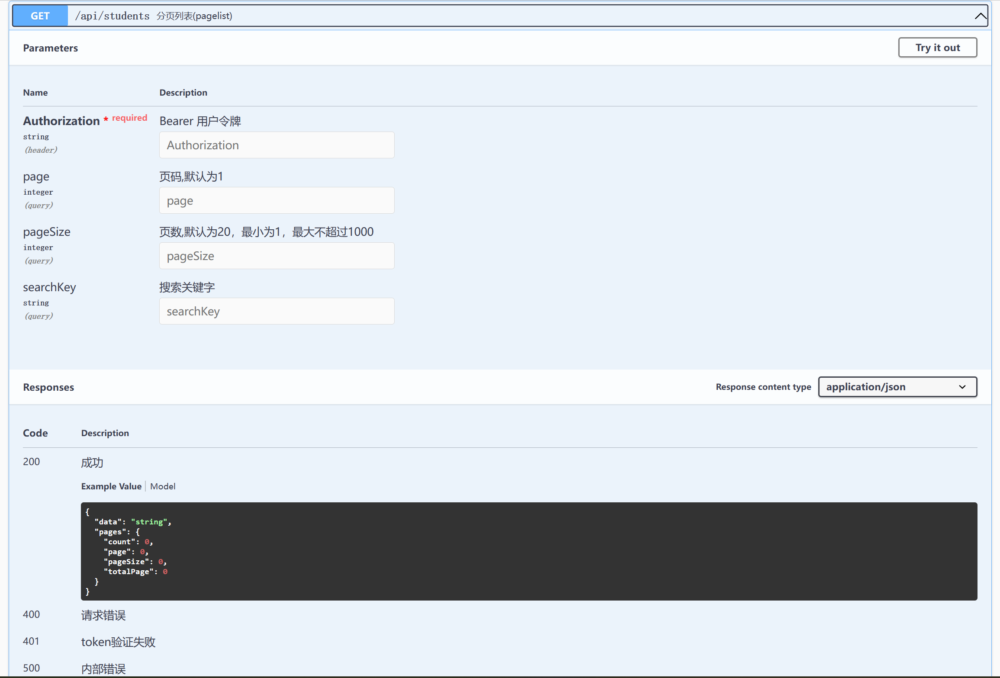

# Comer

[](https://github.com/imoowi/comer/actions?query=workflow%3ACI)
[](https://app.codacy.com/gh/imoowi/comer/dashboard?utm_source=gh&utm_medium=referral&utm_content=&utm_campaign=Badge_grade)
[](https://goreportcard.com/report/github.com/imoowi/comer)
[](https://codecov.io/gh/imoowi/comer)

## Comer 是什么？

Comer是一个用go语言写的RESTFul代码生成工具，能够生成基本的web api框架，同时支持app新增；其中包括gin 、gorm、redis、casbin、auth、captcha等

## 用Comer生成的项目结构
```sh
$ tree
.
|-- README.md
|-- apps //应用集合
|   |-- apps.go //多个应用自动加载文件
|   |-- common //公共模块
|   |   |-- handlers //路由处理方
|   |   |   `-- captcha.handler.go //默认的验证码
|   |   `-- router.go //路由
|   |-- student //通过 comer addapp --app=appName生成
|   |   |-- handlers
|   |   |   `-- student.handler.go
|   |   |-- migrates
|   |   |   `-- student.migrate.go
|   |   |-- models
|   |   |   `-- student.model.go
|   |   |-- repos
|   |   |   `-- student.repo.go
|   |   |-- router.go
|   |   `-- services
|   |       `-- student.service.go
|   |-- swagger //默认包含的swagger文档应用
|   |   `-- router.go
|   `-- user //默认包含用户应用
|       |-- handlers
|       |   `-- auth.handler.go //用户认证
|       |-- migrates //数据迁移文件，会自动生成
|       |   |-- role.migrate.go
|       |   |-- user.migrate.go
|       |   |-- userlog.migrate.go
|       |   `-- userrole.migrate.go
|       |-- models //数据表对应的model，自动生成，表结构通过结构体修改，禁止直接修改数据库里表的结构
|       |   |-- role.model.go //角色
|       |   |-- user.model.go //用户
|       |   |-- userlog.model.go //用户记录
|       |   `-- userrole.model.go //用户角色关系
|       |-- repos //数据提供方
|       |-- router.go //路由
|       `-- services //服务提供方
|-- cmd //由Cobra命令生成
|   |-- init.go //系统初始化
|   |-- migrate.go //数据迁移
|   |-- root.go //主入口
|   `-- server.go api服务
|-- components //组件
|   |-- captcha.go
|   |-- mysql.go
|   `-- redis.go
|-- configs //配置目录
|   |-- casbin.conf
|   `-- settings-local.yml
|-- docs //swagger生成的apidoc
|   |-- docs.go
|   |-- swagger.json
|   `-- swagger.yaml
|-- global //全局文件
|   |-- cache.go
|   |-- casbin.go
|   |-- config.go
|   |-- global.go
|   |-- log.go
|   |-- mysql.go
|   `-- redis.go
|-- go.mod
|-- go.sum
|-- main.go //程序主入口
|-- middlewares //中间件
|   |-- CasbinMiddleware.go //权限控制
|   |-- CrosMiddleware.go //跨域访问
|   |-- JWTAuthMiddleware.go //JWT认证
|   |-- LoggerMiddleware.go //日志
|   |-- RateLimitMiddleware.go //访问频率控制
|   |-- VcodeMiddleware.go //验证码中间件
|   |-- middleware.go
|   `-- token //jwttoken
|       `-- jwttoken.go
|-- router
|   `-- router.go //路由定义
|-- runtime //运行时
`-- utils //工具箱
.
.
.
36 directories, 77 files
```
## 安装

```go
go install github.com/imoowi/comer@latest
```

## 使用

### 1、创建项目

```sh
comer create --module=github.com/imoowi/comer-example 
```
如下:

```sh
$ comer create --module=github.com/imoowi/comer-example
2023/06/26 14:46:34 go.mod not exists
Comer version  v1.2.0

_________
\_   ___ \   ____    _____    ____  _______
/    \  \/  /  _ \  /     \ _/ __ \ \_  __ \
\     \____(  <_> )|  Y Y  \\  ___/  |  | \/
 \______  / \____/ |__|_|  / \___  > |__|
                \/               \/      \/ v1.2.0, built with go1.20.2
dir [ comer-example/apps ] created
...
下一步，执行以下命令:
1、cd  comer-example
2、change file（comer-example/configs/settings-local.yml）mysql and redis config
3、comer addapp --app=appName
4、air OR swag init && go mod tidy && go run . server

```

### 2、给项目添加app

```sh
cd comer-example
comer addapp --app=appName
#或者
comer addapp --app=user --swaggerTags='Oauth' --handler=auth --service=user --model=user,role
```
例如：
```sh
cd comer-example
$ comer addapp --app=student
Comer version  v1.2.0

_________
\_   ___ \   ____    _____    ____  _______
/    \  \/  /  _ \  /     \ _/ __ \ \_  __ \
\     \____(  <_> )|  Y Y  \\  ___/  |  | \/
 \______  / \____/ |__|_|  / \___  > |__|
                \/               \/      \/ v1.2.0, built with go1.20.2
dir [ ./apps ] existed
dir [ ./apps/student/handlers ] created
dir [ ./apps/student/migrates ] created
...
comer addapp end.

```

### 3、安装swag

```sh
go install github.com/swaggo/swag/cmd/swag@latest
```

### 4、生成swagger文档

```sh
swag init
```

### 5、安装air

```sh
go install github.com/cosmtrek/air@latest
```

### 6、修改数据库配置

```yml
#vim ./configs/settings-local.yml
application: # dev开发环境 test测试环境 prod线上环境
  mode: dev
  name: comerProject # 服务名称
server:
  host: 0.0.0.0 # 服务器ip，默认使用 0.0.0.0
  port: 8000 # 服务端口号
  readtimeout: 60 # 读超时时间
  writertimeout: 60 # 写超时时间
logger:
  path: runtime/logs/log # 日志存放路径
  stdout: "" # 日志输出，file：文件，default：命令行，其他：命令行
  level: trace # 日志等级, trace, debug, info, warn, error, fatal
  maxAge: 168h # 日志最长保存时间，7天, ns、us、ms、s、m、h
  rotationTime: 24h # 日志切割级别
ratelimit:
  # 每秒放多少个令牌
  cap: 1000
  # 每秒取多少个令牌
  quantum: 1000
jwt:
  secret: comerProject-admin # token 密钥，生产环境时及的修改
  timeout: 2000h0m0s # token 过期时间 格式：0h0m0s
  refresh_token_timeout: 0h5m0s # token 过期时间减去的时间，用于刷新token
mysql:
  dsn: root:password@tcp(127.0.0.1:3306)/comer_project?charset=utf8&parseTime=True&loc=Local&timeout=1000ms
  casbin: root:password@tcp(127.0.0.1:3306)/comer_project
# influxdb:
#   addr: http://127.0.0.1:8086
#   token: [token string]
#   org: [orgnization name]
#   bucket: [bucket name]
#   testSwitchOn: false
redis:
  addr: com.redis.host:6379
  password: "password"
  db: 0
cache:
  driver: redis
  prefix: "comer_project:cache"

```

### 7、数据迁移:生成基本的数据库表

```sh
go run . migrate
```
例如：
```sh
$ go run . migrate
2023/06/26 14:57:32 Using config file: C:\Users\simpl\dev\golang\imoowi\comer-example\configs\settings-local.yml
2023/06/26 14:57:32 migrate start.
Connected to MySql!

2023/06/26 14:57:32 C:/Users/simpl/dev/golang/imoowi/comer-example/apps/user/migrates/role.migrate.go:23
[1.786ms] [rows:-] SELECT DATABASE()

2023/06/26 14:57:32 C:/Users/simpl/dev/golang/imoowi/comer-example/apps/user/migrates/role.migrate.go:23
[51.542ms] [rows:1] SELECT SCHEMA_NAME from Information_schema.SCHEMATA where SCHEMA_NAME LIKE 'comer_project%' ORDER BY SCHEMA_NAME='comer_project' DESC,SCHEMA_NAME limit 1

2023/06/26 14:57:32 C:/Users/simpl/dev/golang/imoowi/comer-example/apps/user/migrates/role.migrate.go:23
[2.822ms] [rows:-] SELECT count(*) FROM information_schema.tables WHERE table_schema = 'comer_project' AND table_name = 'roles' AND table_type = 'BASE TABLE'

2023/06/26 14:57:32 C:/Users/simpl/dev/golang/imoowi/comer-example/apps/user/migrates/role.migrate.go:23
[35.863ms] [rows:0] CREATE TABLE `roles` (`id` bigint unsigned AUTO_INCREMENT,`created_at` datetime(3) NULL,`updated_at` datetime(3) NULL,`deleted_at` datetime(3) NULL,`name` varchar(30) NOT NULL COMMENT '角色名',`level` tinyint(3) COMMENT '角色等级',PRIMARY KEY (`id`),INDEX `idx_roles_deleted_at` (`deleted_at`))ENGINE=InnoDB,COMMENT='角色表'
...
2023/06/26 14:57:33 migrate end.


```
### 8、初始化数据库

```sh
go run . init
```
例如：
```sh
$ go run . init
2023/06/26 15:00:26 Using config file: C:\Users\simpl\dev\golang\imoowi\comer-example\configs\settings-local.yml
init called
2023/06/26 15:00:26 init start.
Connected to MySql!

2023/06/26 15:00:26 C:/Users/simpl/go/pkg/mod/github.com/casbin/gorm-adapter/v3@v3.18.0/adapter.go:413 SLOW SQL >= 200ms
[222.496ms] [rows:1] SELECT SCHEMA_NAME from Information_schema.SCHEMATA where SCHEMA_NAME LIKE 'comer_project%' ORDER BY SCHEMA_NAME='comer_project' DESC,SCHEMA_NAME limit 1
[GIN-debug] [WARNING] Running in "debug" mode. Switch to "release" mode in production.
 - using env:   export GIN_MODE=release
 - using code:  gin.SetMode(gin.ReleaseMode)


2023/06/26 15:00:26 C:/Users/simpl/dev/golang/imoowi/comer-example/apps/user/repos/role.repo.go:57 record not found
[10.772ms] [rows:0] SELECT * FROM `roles` WHERE name='超级管理员' AND `roles`.`deleted_at` IS NULL ORDER BY `roles`.`id` LIMIT 1

2023/06/26 15:00:26 C:/Users/simpl/dev/golang/imoowi/comer-example/apps/user/repos/role.repo.go:57 record not found
[2.152ms] [rows:0] SELECT * FROM `roles` WHERE name='超级管理员' AND `roles`.`deleted_at` IS NULL ORDER BY `roles`.`id` LIMIT 1

2023/06/26 15:00:26 C:/Users/simpl/dev/golang/imoowi/comer-example/apps/user/repos/role.repo.go:62
[6.441ms] [rows:1] INSERT INTO `roles` (`created_at`,`updated_at`,`deleted_at`,`name`,`level`) VALUES ('2023-06-26 15:00:26.591','2023-06-26 15:00:26.591',NULL,'超级管理员','1')

2023/06/26 15:00:26 C:/Users/simpl/dev/golang/imoowi/comer-example/apps/user/repos/user.repo.go:52 record not found
[7.794ms] [rows:0] SELECT * FROM `users` WHERE id=0 AND `users`.`deleted_at` IS NULL ORDER BY `users`.`id` LIMIT 1
2023/06/26 15:00:59 init end.
```

### 9、运行项目

```sh
air
#或者
go mod tidy
go run . server
```
例如：
```sh
$ air

  __    _   ___
 / /\  | | | |_)
/_/--\ |_| |_| \_ , built with Go

watching .
watching apps
...
building...
[GIN-debug] [WARNING] Creating an Engine instance with the Logger and Recovery middleware already attached.

[GIN-debug] [WARNING] Running in "debug" mode. Switch to "release" mode in production.
 - using env:   export GIN_MODE=release
 - using code:  gin.SetMode(gin.ReleaseMode)

[GIN-debug] GET    /api/students             --> github.com/imoowi/comer-example/apps/student/handlers.StudentPageList (8 handlers)
[GIN-debug] GET    /api/students/:id         --> github.com/imoowi/comer-example/apps/student/handlers.StudentOne (8 handlers)
[GIN-debug] POST   /api/students             --> github.com/imoowi/comer-example/apps/student/handlers.StudentAdd (8 handlers)
[GIN-debug] PUT    /api/students/:id         --> github.com/imoowi/comer-example/apps/student/handlers.StudentUpdate (8 handlers)
[GIN-debug] PATCH  /api/students/:id         --> github.com/imoowi/comer-example/apps/student/handlers.StudentPatch (8 handlers)
[GIN-debug] DELETE /api/students/:id         --> github.com/imoowi/comer-example/apps/student/handlers.StudentDel (8 handlers)
[GIN-debug] GET    /api/common/captcha       --> github.com/imoowi/comer-example/apps/common/handlers.Captcha (6 handlers)
[GIN-debug] GET    /swagger/*any             --> github.com/swaggo/gin-swagger.CustomWrapHandler.func1 (6 handlers)
[GIN-debug] POST   /api/auth-login           --> github.com/imoowi/comer-example/apps/user/handlers.AuthLogin (7 handlers)
[GIN-debug] GET    /api/auth-logout          --> github.com/imoowi/comer-example/apps/user/handlers.AuthLogout (7 handlers)
[GIN-debug] POST   /api/auth-chpwd           --> github.com/imoowi/comer-example/apps/user/handlers.AuthChgPwd (8 handlers)
[GIN-debug] GET    /api/casbins/allapi       --> github.com/imoowi/comer-example/router.InitRouter.func1 (6 handlers)
server port:  8000
API document address http://localhost:8000/swagger/index.html

```

### 10、访问接口文件：
[http://localhost:8000/swagger/index.html](http://localhost:8000/swagger/index.html)


