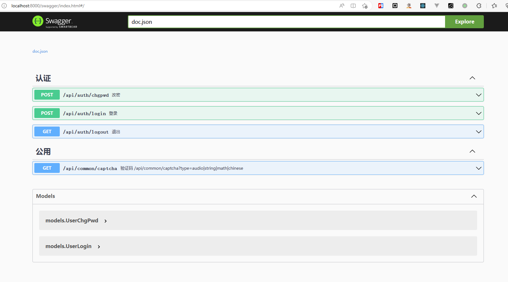
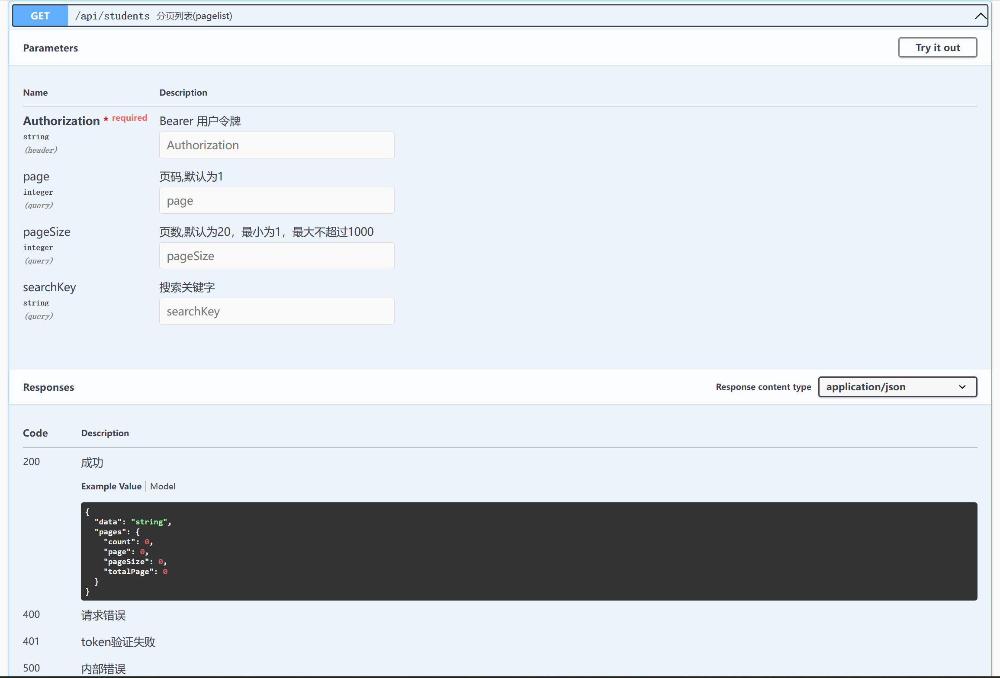

# Comer

[](https://github.com/imoowi/comer/actions?query=workflow%3ACI)
[](https://app.codacy.com/gh/imoowi/comer/dashboard?utm_source=gh&utm_medium=referral&utm_content=&utm_campaign=Badge_grade)
[](https://goreportcard.com/report/github.com/imoowi/comer)
[](https://codecov.io/gh/imoowi/comer)

## What is Comer / Comer 是什么？

Comer is a fast code scaffolding tool written in Go. It generates a basic web API framework, and also supports generating a single controller, service, or model, as well as generating code from custom templates. It integrates frameworks and modules including gin, gorm, redis, casbin, auth, and captcha.

Comer，一个用go语言写的快速生成代码的脚手架，能够生成基本的web api框架，同时支持单个控制器、服务、模型以及从自定义模板生成代码；其中融合了gin 、gorm、redis、casbin、auth、captcha等框架和模块

## Installation / 安装

```go
go install github.com/imoowi/comer@latest
```

## Usage / 使用

### 1. Create a Project / 创建项目

Create a new project:

创建项目：

```sh
comer new github.com/imoowi/comer-example 
```
As follows:

如下:

```sh
$ comer new github.com/imoowi/comer-example

Comer version  v1.3.8

_________
\_   ___ \   ____    _____    ____  _______
/    \  \/  /  _ \  /     \ _/ __ \ \_  __ \
\     \____(  <_> )|  Y Y  \\  ___/  |  | \/
 \______  / \____/ |__|_|  / \___  > |__|
                \/               \/      \/ v1.3.8, built with go1.20.2
dir [ github.com/imoowi/comer-example/apps ] created
...
下一步，执行以下命令:
1、cd  github.com/imoowi/comer-example
2、change file（comer-example/configs/settings-local.yml）mysql and redis config
3、comer add -c=controllerName -w=swaggerTagsName -s=serviceName -m=modelName1,modelName2,[...]
4、go mod tidy
5、swag init
6、go run . server

```

Optionally pass a JSON5 config to override the database name, executable name, and swagger metadata (v2 layout):

可选地传入 JSON5 配置来覆盖数据库名、可执行名与 swagger 元信息（仅 v2 布局）：

```json5
// comer.json5
{
  db_name: "my_db",
  exe_name: "myexe",
  swagger: { title: "My API", version: "2.0", description: "My desc" }
}
```

```sh
comer new github.com/imoowi/comer-example --config=comer.json5
```

### 2. Add a Controller / 添加控制器

Add a controller:

添加控制器：

```sh
cd comer-example
comer add -c=controllerName
#或者
comer add [-a=user] -w='Oauth' -c=auth -s=user -m=user,role
```
For example:

例如：
```sh
$ cd comer-example
$ comer add -c=right
Comer version  v1.3.8

_________
\_   ___ \   ____    _____    ____  _______
/    \  \/  /  _ \  /     \ _/ __ \ \_  __ \
\     \____(  <_> )|  Y Y  \\  ___/  |  | \/
 \______  / \____/ |__|_|  / \___  > |__|
                \/               \/      \/ v1.3.8, built with go1.20.2
dir [ ./internal ] existed
dir [ ./internal/controllers ] existed
dir [ ./internal/migrates ] existed
dir [ ./internal/models ] existed
dir [ ./internal/repos ] existed
dir [ ./internal/router ] existed
dir [ ./internal/services ] existed
file [ ./internal/migrates/right.migrate.go ] created
file [ ./internal/models/right.model.go ] created
file [ ./internal/models/right.filter.go ] created
file [ ./internal/repos/right.repo.go ] created
file [ ./internal/services/right.service.go ] created
file [ ./internal/router/right.router.go ] created
file [ ./internal/controllers/right.controller.go ] created
comer add app end.
```

### 2.1 Define Model Fields / 定义模型字段

Define custom fields for the model (v2 layout only). Without `-f`, the generated model has a single `name` field.

为模型定义自定义字段（仅 v2 布局）。不加 `-f` 时，生成的模型只有一个 `name` 字段。

```sh
comer add -c=post -f=title:string:100 -f=content:text -f=status:int -f=created_at:datetime
```

Field format: `name:type[:size][:comment][:validate]`. Supported types:

字段格式：`name:type[:size][:comment][:validate]`。支持的类型：

| type 类型 | Go 类型 | GORM 类型 |
|---|---|---|
| string | string | varchar(size)（默认 30 / default 30） |
| text | string | text / tinytext / mediumtext / longtext |
| int | int | int |
| int64 / bigint | int64 | bigint |
| uint | uint | int unsigned |
| uint8 | uint8 | tinyint unsigned |
| uint16 | uint16 | smallint unsigned |
| uint32 | uint32 | int unsigned |
| uint64 | uint64 | bigint unsigned |
| float64 / decimal / float | float64 | decimal(p,s)（默认 10,2 / default 10,2） |
| float32 | float32 | float |
| bool | bool | tinyint(1) |
| datetime / time | time.Time | datetime |
| date | time.Time | date |
| json | json.RawMessage | json |
| slice / array | []string | json |

For `decimal`, precision/scale accepts a comma (`10,4`) or a dot (`10.4`).

`decimal` 的精度/小数位可用逗号（`10,4`）或点号（`10.4`）。

Or put fields in a file (one per line, `#` for comments) and pass it with `--fieldConfig`:

也可以把字段写进文件（一行一个，`#` 为注释），用 `--fieldConfig` 传入：

```
# post.fields
title:string:100:标题
content:text
status:int
```

```sh
comer add -c=post --fieldConfig=post.fields
```

Optional `:validate` appends a `binding` tag (e.g. `title:string:100:标题:required,min=2`), mapped to the project's custom validators. Use `--searchColumn` to override the pagination search column (default: first string/text field, else `name`).

可选的 `:validate` 段会追加 `binding` 标签（如 `title:string:100:标题:required,min=2`），映射到项目的自定义校验规则。用 `--searchColumn` 覆盖分页搜索字段（默认取第一个 string/text 字段，缺省 `name`）。

Note: the `binding` tag only takes effect on the **Add** path (which binds into the model struct); the **Update** path binds into a `map[string]any`, so update validation is not enforced.

注意：`binding` 标签只在**新增**路径生效（绑定到模型结构体）；**更新**路径绑定到 `map[string]any`，不触发校验。

```sh
comer add -c=post -f=title:string:100:标题:required,min=2 --searchColumn=title
```

### 2.2 Remove a Controller / 删除控制器

Remove the files that `comer add` generated for a controller (v2 layout only). Pass the same `-c/-s/-m` flags you used with `add`; use `--dry-run` to preview without deleting.

删除 `comer add` 为某控制器生成的文件（仅 v2 布局）。传入与 `add` 相同的 `-c/-s/-m`；加 `--dry-run` 可预览而不实际删除。

```sh
comer remove -c=post            # delete / 删除
comer remove -c=post --dry-run  # preview / 预览
```

> `remove` only understands the built-in v2 layout and cannot reverse `add-with-tpl` (custom templates). / `remove` 仅识别内置 v2 布局，无法逆转 `add-with-tpl`（自定义模板）。

### 3. Add via Custom Templates / 通过自定义模板添加

Add an app using custom templates:

通过自定义模板添加：

- 3.1 Create a `.comer-templates` folder in the project root. / 在项目根目录下创建文件夹：".comer-templates"
- 3.2 Create the config file `.comer-templates/setting.json5`. / 创建配置文件".comer-templates/setting.json5"
```json5
[
  {
    var: [
      {
        module_name: "github.com/imoowi/examples/comer_add_with_tpl", //项目根目录下go.mod文件里的module (module name in go.mod)
        controller_name: "PostPlus", // 控制器名 (controller name)
        service_name: "", // 服务名；如果为空，使用ControllerName (service name; defaults to ControllerName)
        model_name: "", // 数据库模型名；如果为空，使用ServiceName (model name; defaults to ServiceName)
        swagger_tags: "PostPlus(页面加)",
      },
      {
        module_name: "github.com/imoowi/examples/comer_add_with_tpl",
        controller_name: "PostPlus2",
        service_name: "",
        model_name: "",
        swagger_tags: "PostPlus2(页面加)",
      },
    ],
    // 控制器 (controller)
    controller: [
      {
        dir: "internal/controllers",
        tpl: "controller.tpl",
      },
    ],
    // 数据迁移 (migration)
    migrate: [
      {
        dir: "internal/db/migrates",
        tpl: "migrate.tpl",
      },
    ],
    // 模型 (model)
    model: [
      {
        dir: "internal/models",
        tpl: "model.tpl",
      },
    ],
    // 数据资源 (repository)
    repo: [
      {
        dir: "internal/models",
        tpl: "repo.tpl",
      },
    ],
    // 服务 (service)
    service: [
      {
        dir: "internal/services",
        tpl: "service.tpl",
      },
    ],
    // 路由 (router)
    router: [
      {
        dir: "internal/app/monitor/router",
        tpl: "router.tpl",
      },
      {
        dir: "internal/app/designer/router",
        tpl: "router2.tpl",
      },
    ],
  },
]

```
- 3.3 Create the template files; see `example/comer_add_with_tpl`. / 创建模板文件，详情请见:"example/comer_add_with_tpl"
```
$ tree .comer-templates/
.comer-templates/
|-- controller.tpl
|-- migrate.tpl
|-- model.tpl
|-- repo.tpl
|-- router.tpl
|-- service.tpl
`-- setting.json5

0 directories, 7 files
```

`add-with-tpl` supports `--dry-run` (preview without writing) and the same field flags as `add` (`-f/--field`, `--fieldConfig`, `--searchColumn`), so custom templates can use `{{.Fields}}`, `{{.SearchColumn}}`, `{{.HasTime}}` and `{{.HasJSON}}`.

`add-with-tpl` 支持 `--dry-run`（预览而不落盘），并支持与 `add` 相同的字段 flag（`-f/--field`、`--fieldConfig`、`--searchColumn`），自定义模板可用 `{{.Fields}}`、`{{.SearchColumn}}`、`{{.HasTime}}`、`{{.HasJSON}}`。

- 3.4 Run the command `comer add-with-tpl`. / 运行命令: "comer add-with-tpl"
```sh
$ comer add-with-tpl
Comer version  v1.3.8

_________
\_   ___ \   ____    _____    ____  _______
/    \  \/  /  _ \  /     \ _/ __ \ \_  __ \
\     \____(  <_> )|  Y Y  \\  ___/  |  | \/
 \______  / \____/ |__|_|  / \___  > |__|
                \/               \/      \/ v1.3.8, built with go1.20.2
comer-templates dir is:  .comer-templates
dir [ internal/controllers ] created
dir [ internal/services ] created
dir [ internal/models ] created
dir [ internal/models ] existed
dir [ internal/db/migrates ] created
dir [ internal/app/monitor/router ] created
file [ ./internal/controllers/post_plus.controller.go ] created
file [ ./internal/db/migrates/post_plus.migrate.go ] created
file [ ./internal/models/post_plus.model.go ] created
file [ ./internal/models/post_plus.repo.go ] created
file [ ./internal/services/post_plus.service.go ] created
file [ ./internal/app/monitor/router/post_plus.router.go ] created
file [ ./internal/controllers/post_plus2.controller.go ] created
file [ ./internal/db/migrates/post_plus2.migrate.go ] created
file [ ./internal/models/post_plus2.model.go ] created
file [ ./internal/models/post_plus2.repo.go ] created
file [ ./internal/services/post_plus2.service.go ] created
file [ ./internal/app/monitor/router/post_plus2.router.go ] created
```

### 4. Generate Swagger Docs / 生成swagger文档

Generate Swagger documentation:

生成swagger文档：

```sh
#依赖swago, go install github.com/swaggo/swag/cmd/swag@latest
swag init
```


### 5. Configure the Database / 修改数据库配置

Modify the database configuration:

修改数据库配置：

```yml
#vim ./configs/settings-local.yml
application: # dev开发环境(dev) test测试环境(test) prod线上环境(prod)
  mode: dev
  name: comerProject # 服务名称 (service name)
server:
  host: 0.0.0.0 # 服务器ip，默认使用 0.0.0.0 (server IP, defaults to 0.0.0.0)
  port: 8000 # 服务端口号 (server port)
  readtimeout: 60 # 读超时时间 (read timeout)
  writertimeout: 60 # 写超时时间 (write timeout)
logger:
  path: runtime/logs/log # 日志存放路径 (log directory)
  stdout: "" # 日志输出，file：文件，default：命令行，其他：命令行 (log output: file=file, default=stdout, other=stdout)
  level: trace # 日志等级, trace, debug, info, warn, error, fatal (log level: trace, debug, info, warn, error, fatal)
  maxAge: 168h # 日志最长保存时间，7天, ns、us、ms、s、m、h (max log retention, e.g. 7 days; units: ns/us/ms/s/m/h)
  rotationTime: 24h # 日志切割级别 (log rotation interval)
ratelimit:
  # 每秒放多少个令牌 (tokens added per second)
  cap: 1000
  # 每秒取多少个令牌 (tokens consumed per second)
  quantum: 1000
jwt:
  secret: comerProject-admin # token 密钥，生产环境时及的修改 (JWT secret; change it in production)
  timeout: 2000h0m0s # token 过期时间 格式：0h0m0s (token expiry, format 0h0m0s)
  refresh_token_timeout: 0h5m0s # token 过期时间减去的时间，用于刷新token (time subtracted from expiry, used to refresh the token)
mysql:
  dsn: root:password@tcp(127.0.0.1:3306)/comer_project?charset=utf8&parseTime=True&loc=Local&timeout=1000ms
  casbin: root:password@tcp(127.0.0.1:3306)/comer_project
redis:
  addr: com.redis.host:6379
  password: "password"
  db: 0
cache:
  driver: redis
  prefix: "comer_project:cache"

```

### 6. Data Migration: Create Tables / 数据迁移:生成基本的数据库表

Migrate to generate the basic database tables:

数据迁移，生成基本的数据库表：

```sh
go run . migrate
```
### 7. Initialize the Database / 初始化数据库

Initialize the database:

初始化数据库：

```sh
go run . init
```
### 8. Run the Project / 运行项目

Run the project:

运行项目：

```sh
#依赖air, go install github.com/cosmtrek/air@latest
air
#或者
go mod tidy
go run . server
```
For example:

例如：
```sh
$ air

  __    _   ___
 / /\  | | | |_)
/_/--\ |_| |_| \_ , built with Go

watching .
watching apps
...
building...
[GIN-debug] [WARNING] Creating an Engine instance with the Logger and Recovery middleware already attached.

[GIN-debug] [WARNING] Running in "debug" mode. Switch to "release" mode in production.
 - using env:   export GIN_MODE=release
 - using code:  gin.SetMode(gin.ReleaseMode)
[GIN-debug] GET    /swagger/*any             --> github.com/swaggo/gin-swagger.CustomWrapHandler.func1 (6 controllers)
[GIN-debug] POST   /api/auth-login           --> github.com/imoowi/comer-example/apps/user/controllers.AuthLogin (7 controllers)
[GIN-debug] GET    /api/auth-logout          --> github.com/imoowi/comer-example/apps/user/controllers.AuthLogout (7 controllers)
[GIN-debug] POST   /api/auth-chpwd           --> github.com/imoowi/comer-example/apps/user/controllers.AuthChgPwd (8 controllers)
[GIN-debug] GET    /api/casbins/allapi       --> github.com/imoowi/comer-example/router.InitRouter.func1 (6 controllers)
...
server port:  8000
API document address http://localhost:8000/swagger/index.html

```

### 9. Access the API Docs / 访问接口文件：

Access the API docs at:

访问接口文件：

[http://localhost:8000/swagger/index.html](http://localhost:8000/swagger/index.html)



## Runtime Library / 运行时库

Generated projects import `github.com/imoowi/comer` as their runtime library (`interfaces/`, `components/`, `utils/`, `validators/`). Key capabilities:

- `interfaces/impl.Repo[T]` / `Service[T]` — generic CRUD plus `Transaction`, `BatchAdd`, `BatchDelete`, `UnscopedOne`, `Restore`.
- `interfaces/impl.Filter.BuildPageListFilter` — clamps `page`/`pageSize` (page ≥ 1, pageSize 1–1000).
- `components.MemCacheT[T]` — typed in-memory cache with `SetOneTTL`/`SetArrayTTL` and `Flush`.
- `components.GenCaptcha(driverType)` — `digit|string|math|chinese|audio`; `SetCaptchaStore` + `RedisCaptchaStore` for Redis-backed captcha.

生成工程会把 `github.com/imoowi/comer` 作为运行时库引用（`interfaces/`、`components/`、`utils/`、`validators/`）。主要能力：

- `interfaces/impl.Repo[T]` / `Service[T]` — 通用 CRUD，另含 `Transaction`、`BatchAdd`、`BatchDelete`、`UnscopedOne`、`Restore`。
- `interfaces/impl.Filter.BuildPageListFilter` — 钳制 `page`/`pageSize`（page ≥ 1，pageSize 1–1000）。
- `components.MemCacheT[T]` — 类型化内存缓存，含 `SetOneTTL`/`SetArrayTTL` 与 `Flush`。
- `components.GenCaptcha(driverType)` — `digit|string|math|chinese|audio`；`SetCaptchaStore` 与 `RedisCaptchaStore` 支持 Redis 验证码存储。

## Directory Structure / 目录结构

- Version 2 / 版本2
```sh
$ tree
.
|-- Dockerfile 
|-- Makefile
|-- README.md
|-- cmd //入口 (entry)
|   |-- init.go //初始化系统 (system init)
|   |-- migrate.go //数据迁移 (migration)
|   |-- root.go 
|   `-- server.go //web server
|-- configs //配置文件 (config)
|   |-- casbin.conf
|   `-- settings-local.yml 
|-- docker-compose.yml
|-- docs //swagger生成的api文档目录 (generated swagger API docs)
|   |-- init.go
|-- go.mod
|-- go.sum
|-- internal
|   |-- controllers //控制器 (controllers)
|   |   |-- auth.controller.go
|   |   |-- captcha.controller.go
|   |   |-- event.controller.go
|   |   `-- user.controller.go
|   |-- global //全局变量 (global variables)
|   |   |-- cache.go
|   |   |-- casbin.go
|   |   |-- config.go
|   |   |-- global.go
|   |   |-- global.userlog.go
|   |   |-- log.go
|   |   |-- mysql.go
|   |   `-- redis.go
|   |-- middlewares //中间件 (middlewares)
|   |   |-- CasbinMiddleware.go //权限 (permission)
|   |   |-- CrosMiddleware.go //跨域 (CORS)
|   |   |-- JWTAuthMiddleware.go //jwt
|   |   |-- LoggerMiddleware.go //日志 (logging)
|   |   |-- RateLimitMiddleware.go //频率限制 (rate limit)
|   |   |-- RequestIdMiddleware.go //请求id (request id)
|   |   |-- UserlogMiddleware.go //用户日志 (user log)
|   |   |-- VcodeMiddleware.go //验证码 (captcha)
|   |   |-- middleware.go 
|   |   `-- token
|   |       `-- jwttoken.go
|   |-- migrates //数据迁移 (migration)
|   |   |-- init.go
|   |   |-- role.migrate.go
|   |   |-- user.migrate.go
|   |   |-- user_log.migrate.go
|   |   `-- user_role.migrate.go
|   |-- models //模型 (models)
|   |   |-- role.filter.go
|   |   |-- role.model.go
|   |   |-- user.filter.go
|   |   |-- user.model.go
|   |   |-- user_log.filter.go
|   |   |-- user_log.model.go
|   |   |-- user_role.filter.go
|   |   `-- user_role.model.go
|   |-- repos //数据提供者 (repositories)
|   |   |-- init.go
|   |-- router //路由定义 (routing)
|   |   |-- auth.router.go
|   |   |-- common.router.go
|   |   |-- init.go
|   `-- services //服务层 (services)
|       |-- init.go
|-- main.go
|-- runtime
|-- start_server_in_docker.sh
`-- test
    `-- login.go
```

- Version 1 (legacy) / 版本1（旧版）
```sh
$ tree
.
|-- README.md
|-- .comer-templates
|-- apps //应用集合 (apps)
|   |-- apps.go //多个应用自动加载文件 (auto-loads all apps)
|   |-- common //公共模块 (common module)
|   |   |-- controllers //路由处理方 (controllers)
|   |   |   `-- captcha.controller.go //默认的验证码 (default captcha)
|   |   `-- router.go //路由 (routing)
|   |-- student //通过 comer add -a=appName生成 (generated by `comer add -a=appName`)
|   |   |-- controllers
|   |   |   `-- student.controller.go
|   |   |-- migrates
|   |   |   `-- student.migrate.go
|   |   |-- models
|   |   |   `-- student.model.go
|   |   |-- repos
|   |   |   `-- student.repo.go
|   |   |-- router.go
|   |   `-- services
|   |       `-- student.service.go
|   |-- swagger //默认包含的swagger文档应用 (bundled swagger docs app)
|   |   `-- router.go
|   `-- user //默认包含用户应用 (bundled user app)
|       |-- controllers
|       |   `-- auth.controller.go //用户认证 (auth)
|       |-- migrates //数据迁移文件，会自动生成 (auto-generated migrations)
|       |   |-- role.migrate.go
|       |   |-- user.migrate.go
|       |   |-- userlog.migrate.go
|       |   `-- userrole.migrate.go
|       |-- models //数据表对应的model，自动生成，表结构通过结构体修改，禁止直接修改数据库里表的结构 (models mapped to tables; modify the schema via the struct, never edit the DB directly)
|       |   |-- role.model.go //角色 (role)
|       |   |-- user.model.go //用户 (user)
|       |   |-- userlog.model.go //用户记录 (user log)
|       |   `-- userrole.model.go //用户角色关系 (user-role relation)
|       |-- repos //数据提供方 (repositories)
|       |-- router.go //路由 (routing)
|       `-- services //服务提供方 (services)
|-- cmd //由Cobra命令生成 (generated by Cobra)
|   |-- init.go //系统初始化 (system init)
|   |-- migrate.go //数据迁移 (migration)
|   |-- root.go //主入口 (main entry)
|   `-- server.go api服务 (API server)
|-- components //组件 (components)
|   |-- captcha.go
|   |-- mysql.go
|   `-- redis.go
|-- configs //配置目录 (config)
|   |-- casbin.conf
|   `-- settings-local.yml
|-- docs //swagger生成的apidoc (generated swagger API docs)
|   |-- docs.go
|   |-- swagger.json
|   `-- swagger.yaml
|-- global //全局文件 (global)
|   |-- cache.go
    ...
|   `-- redis.go
|-- go.mod
|-- go.sum
|-- main.go //程序主入口 (main entry)
|-- middlewares //中间件 (middlewares)
|   |-- CasbinMiddleware.go //权限控制 (permission)
|   |-- CrosMiddleware.go //跨域访问 (CORS)
|   |-- JWTAuthMiddleware.go //JWT认证 (JWT auth)
|   |-- LoggerMiddleware.go //日志 (logging)
|   |-- RateLimitMiddleware.go //访问频率控制 (rate limit)
|   |-- VcodeMiddleware.go //验证码中间件 (captcha middleware)
|   |-- middleware.go
|   `-- token //jwttoken
|       `-- jwttoken.go
|-- router
|   `-- router.go //路由定义 (routing)
|-- runtime //运行时 (runtime)
`-- utils //工具箱 (utilities)
```
