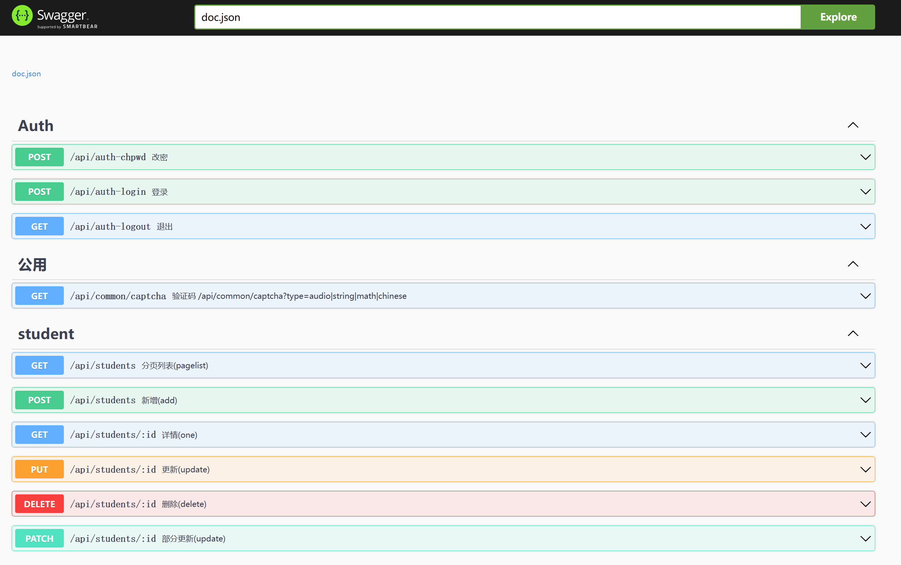

# Comer

[](https://github.com/imoowi/comer/actions?query=workflow%3ACI)
[](https://app.codacy.com/gh/imoowi/comer/dashboard?utm_source=gh&utm_medium=referral&utm_content=&utm_campaign=Badge_grade)
[](https://goreportcard.com/report/github.com/imoowi/comer)
[](https://codecov.io/gh/imoowi/comer)

## Comer 是什么？

Comer是一个用go语言写的RESTFul代码生成工具，能够生成基本的web api框架，同时支持app新增以及从自定义模板生成代码；其中包括gin 、gorm、redis、casbin、auth、captcha等

## 安装

```go
go install github.com/imoowi/comer@latest
```

## 使用

### 1、创建项目

```sh
comer new github.com/imoowi/comer-example 
```
如下:

```sh
$ comer new github.com/imoowi/comer-example

Comer version  v1.3.4

_________
\_   ___ \   ____    _____    ____  _______
/    \  \/  /  _ \  /     \ _/ __ \ \_  __ \
\     \____(  <_> )|  Y Y  \\  ___/  |  | \/
 \______  / \____/ |__|_|  / \___  > |__|
                \/               \/      \/ v1.3.4, built with go1.20.2
dir [ github.com/imoowi/comer-example/apps ] created
...
下一步，执行以下命令:
1、cd  github.com/imoowi/comer-example
2、change file（comer-example/configs/settings-local.yml）mysql and redis config
3、comer add -c=controllerName -w=swaggerTagsName -s=serviceName -m=modelName1,modelName2,[...]
4、go mod tidy
5、swag init
6、go run . server

```

### 2、添加控制器

```sh
cd comer-example
comer add -c=controllerName
#或者
comer add [-a=user] -w='Oauth' -c=auth -s=user -m=user,role
```
例如：
```sh
$ cd comer-example
$ comer add -a=student
Comer version  v1.3.4

_________
\_   ___ \   ____    _____    ____  _______
/    \  \/  /  _ \  /     \ _/ __ \ \_  __ \
\     \____(  <_> )|  Y Y  \\  ___/  |  | \/
 \______  / \____/ |__|_|  / \___  > |__|
                \/               \/      \/ v1.3.4, built with go1.20.2
dir [ ./apps ] existed
dir [ ./apps/student/controllers ] created
dir [ ./apps/student/migrates ] created
...
comer add end.

```

### 3、通过自定义模板添加
- 3.1 在项目根目录下创建文件夹：".comer-templates"
- 3.2 创建配置文件".comer-templates/setting.json5"
```json5
[
  {
    var: [
      {
        module_name: "github.com/imoowi/examples/comer_add_with_tpl", //项目根目录下go.mod文件里的module
        controller_name: "PostPlus", // 控制器名
        service_name: "", // 服务名；如果为空，使用ControllerName
        model_name: "", // 数据库模型名；如果为空，使用ServiceName
        swagger_tags: "PostPlus(页面加)",
      },
      {
        module_name: "github.com/imoowi/examples/comer_add_with_tpl",
        controller_name: "PostPlus2",
        service_name: "",
        model_name: "",
        swagger_tags: "PostPlus2(页面加)",
      },
    ],
    // 控制器
    controller: [
      {
        dir: "internal/controllers",
        tpl: "controller.tpl",
      },
    ],
    // 数据迁移
    migrate: [
      {
        dir: "internal/db/migrates",
        tpl: "migrate.tpl",
      },
    ],
    // 模型
    model: [
      {
        dir: "internal/models",
        tpl: "model.tpl",
      },
    ],
    // 数据资源
    repo: [
      {
        dir: "internal/models",
        tpl: "repo.tpl",
      },
    ],
    // 服务
    service: [
      {
        dir: "internal/services",
        tpl: "service.tpl",
      },
    ],
    // 路由
    router: [
      {
        dir: "internal/app/monitor/router",
        tpl: "router.tpl",
      },
      {
        dir: "internal/app/designer/router",
        tpl: "router2.tpl",
      },
    ],
  },
]

```
- 3.3 创建模板文件，详情请见:"example/comer_add_with_tpl"
```
$ tree .comer-templates/
.comer-templates/
|-- controller.tpl
|-- migrate.tpl
|-- model.tpl
|-- repo.tpl
|-- router.tpl
|-- service.tpl
`-- setting.json5

0 directories, 7 files
```
- 3.4 运行命令: "comer add-with-tpl"
```sh
$ comer add-with-tpl
Comer version  v1.3.4

_________
\_   ___ \   ____    _____    ____  _______
/    \  \/  /  _ \  /     \ _/ __ \ \_  __ \
\     \____(  <_> )|  Y Y  \\  ___/  |  | \/
 \______  / \____/ |__|_|  / \___  > |__|
                \/               \/      \/ v1.3.4, built with go1.20.2
comer-templates dir is:  .comer-templates
dir [ internal/controllers ] created
dir [ internal/services ] created
dir [ internal/models ] created
dir [ internal/models ] existed
dir [ internal/db/migrates ] created
dir [ internal/app/monitor/router ] created
file [ ./internal/controllers/post_plus.controller.go ] created
file [ ./internal/db/migrates/post_plus.migrate.go ] created
file [ ./internal/models/post_plus.model.go ] created
file [ ./internal/models/post_plus.repo.go ] created
file [ ./internal/services/post_plus.service.go ] created
file [ ./internal/app/monitor/router/post_plus.router.go ] created
file [ ./internal/controllers/post_plus2.controller.go ] created
file [ ./internal/db/migrates/post_plus2.migrate.go ] created
file [ ./internal/models/post_plus2.model.go ] created
file [ ./internal/models/post_plus2.repo.go ] created
file [ ./internal/services/post_plus2.service.go ] created
file [ ./internal/app/monitor/router/post_plus2.router.go ] created
```

### 4、生成swagger文档

```sh
#依赖swago, go install github.com/swaggo/swag/cmd/swag@latest
swag init
```


### 5、修改数据库配置

```yml
#vim ./configs/settings-local.yml
application: # dev开发环境 test测试环境 prod线上环境
  mode: dev
  name: comerProject # 服务名称
server:
  host: 0.0.0.0 # 服务器ip，默认使用 0.0.0.0
  port: 8000 # 服务端口号
  readtimeout: 60 # 读超时时间
  writertimeout: 60 # 写超时时间
logger:
  path: runtime/logs/log # 日志存放路径
  stdout: "" # 日志输出，file：文件，default：命令行，其他：命令行
  level: trace # 日志等级, trace, debug, info, warn, error, fatal
  maxAge: 168h # 日志最长保存时间，7天, ns、us、ms、s、m、h
  rotationTime: 24h # 日志切割级别
ratelimit:
  # 每秒放多少个令牌
  cap: 1000
  # 每秒取多少个令牌
  quantum: 1000
jwt:
  secret: comerProject-admin # token 密钥，生产环境时及的修改
  timeout: 2000h0m0s # token 过期时间 格式：0h0m0s
  refresh_token_timeout: 0h5m0s # token 过期时间减去的时间，用于刷新token
mysql:
  dsn: root:password@tcp(127.0.0.1:3306)/comer_project?charset=utf8&parseTime=True&loc=Local&timeout=1000ms
  casbin: root:password@tcp(127.0.0.1:3306)/comer_project
redis:
  addr: com.redis.host:6379
  password: "password"
  db: 0
cache:
  driver: redis
  prefix: "comer_project:cache"

```

### 6、数据迁移:生成基本的数据库表

```sh
go run . migrate
```
### 7、初始化数据库

```sh
go run . init
```
### 8、运行项目

```sh
#依赖air, go install github.com/cosmtrek/air@latest
air
#或者
go mod tidy
go run . server
```
例如：
```sh
$ air

  __    _   ___
 / /\  | | | |_)
/_/--\ |_| |_| \_ , built with Go

watching .
watching apps
...
building...
[GIN-debug] [WARNING] Creating an Engine instance with the Logger and Recovery middleware already attached.

[GIN-debug] [WARNING] Running in "debug" mode. Switch to "release" mode in production.
 - using env:   export GIN_MODE=release
 - using code:  gin.SetMode(gin.ReleaseMode)
[GIN-debug] GET    /swagger/*any             --> github.com/swaggo/gin-swagger.CustomWrapHandler.func1 (6 controllers)
[GIN-debug] POST   /api/auth-login           --> github.com/imoowi/comer-example/apps/user/controllers.AuthLogin (7 controllers)
[GIN-debug] GET    /api/auth-logout          --> github.com/imoowi/comer-example/apps/user/controllers.AuthLogout (7 controllers)
[GIN-debug] POST   /api/auth-chpwd           --> github.com/imoowi/comer-example/apps/user/controllers.AuthChgPwd (8 controllers)
[GIN-debug] GET    /api/casbins/allapi       --> github.com/imoowi/comer-example/router.InitRouter.func1 (6 controllers)
...
server port:  8000
API document address http://localhost:8000/swagger/index.html

```

### 9、访问接口文件：
[http://localhost:8000/swagger/index.html](http://localhost:8000/swagger/index.html)



## 目录结构
```sh
$ tree
.
|-- README.md
|-- .comer-templates
|-- apps //应用集合
|   |-- apps.go //多个应用自动加载文件
|   |-- common //公共模块
|   |   |-- controllers //路由处理方
|   |   |   `-- captcha.controller.go //默认的验证码
|   |   `-- router.go //路由
|   |-- student //通过 comer add -a=appName生成
|   |   |-- controllers
|   |   |   `-- student.controller.go
|   |   |-- migrates
|   |   |   `-- student.migrate.go
|   |   |-- models
|   |   |   `-- student.model.go
|   |   |-- repos
|   |   |   `-- student.repo.go
|   |   |-- router.go
|   |   `-- services
|   |       `-- student.service.go
|   |-- swagger //默认包含的swagger文档应用
|   |   `-- router.go
|   `-- user //默认包含用户应用
|       |-- controllers
|       |   `-- auth.controller.go //用户认证
|       |-- migrates //数据迁移文件，会自动生成
|       |   |-- role.migrate.go
|       |   |-- user.migrate.go
|       |   |-- userlog.migrate.go
|       |   `-- userrole.migrate.go
|       |-- models //数据表对应的model，自动生成，表结构通过结构体修改，禁止直接修改数据库里表的结构
|       |   |-- role.model.go //角色
|       |   |-- user.model.go //用户
|       |   |-- userlog.model.go //用户记录
|       |   `-- userrole.model.go //用户角色关系
|       |-- repos //数据提供方
|       |-- router.go //路由
|       `-- services //服务提供方
|-- cmd //由Cobra命令生成
|   |-- init.go //系统初始化
|   |-- migrate.go //数据迁移
|   |-- root.go //主入口
|   `-- server.go api服务
|-- components //组件
|   |-- captcha.go
|   |-- mysql.go
|   `-- redis.go
|-- configs //配置目录
|   |-- casbin.conf
|   `-- settings-local.yml
|-- docs //swagger生成的apidoc
|   |-- docs.go
|   |-- swagger.json
|   `-- swagger.yaml
|-- global //全局文件
|   |-- cache.go
    ...
|   `-- redis.go
|-- go.mod
|-- go.sum
|-- main.go //程序主入口
|-- middlewares //中间件
|   |-- CasbinMiddleware.go //权限控制
|   |-- CrosMiddleware.go //跨域访问
|   |-- JWTAuthMiddleware.go //JWT认证
|   |-- LoggerMiddleware.go //日志
|   |-- RateLimitMiddleware.go //访问频率控制
|   |-- VcodeMiddleware.go //验证码中间件
|   |-- middleware.go
|   `-- token //jwttoken
|       `-- jwttoken.go
|-- router
|   `-- router.go //路由定义
|-- runtime //运行时
`-- utils //工具箱
```
